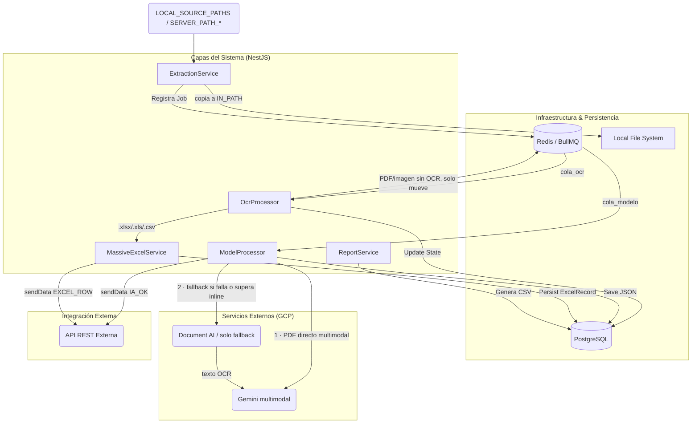

# 🏛 Arquitectura y Flujos

Detalle del pipeline, diagramas y módulos. Consultar al trabajar en `extraction`, `ocr`, `model`, `report`, `tenant`, `integration`.

## Diagrama de Arquitectura (Container Level)

## Flujo Masivo (Excel/CSV)

`MassiveExcelService` bypasea OCR/IA por completo (`.xlsx`/`.xls`/`.csv` deben ir directo a DB). Lee workbook con `exceljs` streaming → detecta tipo oficio → `mapRowToPayload()` por fila → consecutivo atómico via `DailySequenceService` → persiste en `ExcelRecord` (idempotente: limpia registros previos del mismo archivo antes de re-insertar) → `startBatch` → `sendData` por fila con concurrencia controlada → mueve archivo a `EXCEL_DESTINATION_PATH` → estado `EXCEL_OK`.

## Flujo Individual (IA multimodal primero — PDF directo; OCR solo fallback)

**El modelo de IA es ahora el camino PRINCIPAL de extracción.** `OcrProcessor` (`cola_ocr`) ya NO ejecuta OCR para PDF/imágenes: solo enruta (Excel bypass, formato no soportado), mueve el archivo a `OCR_PATH` y lo encola a `cola_modelo` SIN texto.

`ModelProcessor` → `extraerMultimodalConFallback(filePath)`:
1. **Principal:** envía el PDF/imagen **directo a Gemini (multimodal)**. Gemini acepta PDF nativo, **sin el tope de ~30 páginas** de Document AI (imageless): así un oficio de +30 páginas se procesa sin problema.
2. **Fallback (Document AI):** si el multimodal falla, o el archivo supera `GEMINI_INLINE_MAX_MB` (default 15 MB, demasiado grande para enviarlo inline), cae a Document AI (OCR) → texto → Gemini.
3. Si ni el multimodal ni el OCR extraen contenido → `MODEL_ERROR` (revisión).

Luego post-procesa JSON (fechas, `nombreOficioFinal` con consecutivo atómico, rename) → mueve a `OCR_DESTINATION_PATH` → `sendData` → estado `IA_OK`.

> **Document AI sigue siendo dependencia OBLIGATORIA** por ser el fallback: `DOCUMENT_AI_PROCESSOR_ID`, `GCP_PROJECT_ID` y las credenciales GCP deben permanecer configuradas.

(Antes el flujo era OCR primero → texto → Gemini; ahora es Gemini multimodal primero → fallback OCR.)

## Pipeline de estados

`INGRESADO → EN_COLA_OCR → PROCESANDO_OCR → EN_COLA_MODELO → PROCESANDO_MODELO → IA_OK`

> Con el flujo multimodal, `PROCESANDO_OCR` es ahora una etapa de **enrutamiento/staging** (mueve el archivo, no extrae OCR); la extracción real (multimodal, o fallback Document AI) ocurre en `PROCESANDO_MODELO`.

Estados terminales de error: `ERROR_OCR`, `MODEL_ERROR`, `FORMATO_NO_SOPORTADO`.
Excel: `PROCESANDO_EXCEL → EXCEL_OK` (errores de Excel quedan como `ERROR_OCR`, sin estado dedicado).

> **2026-06-24:** se eliminaron del enum `DocumentState` los valores `OCR_UNREADABLE`, `DUPLICADO` y `ERROR_EXCEL` (vestigiales, sin ningún setter en el código vigente). Ver `migrations/20260624_cleanup_document_state_enum/migration.sql` y la entrada correspondiente en `.agents/decisions.md`.

## Multitenancy (`src/modules/tenant`)

`TenantModule` (`@Global()`) provee `'TENANT_PROFILE'` token. Perfiles en `src/modules/tenant/profiles/*.profile.ts`. Cada perfil define: `promptTemplate`, `responseSchema` (Gemini Schema), `clientFields`, `nonClientFields`, `identifierKey`.

Al editar un perfil, mantener en sync: `responseSchema` (lo que Gemini debe retornar), `promptTemplate` (reglas de extracción), y `clientFields`/`nonClientFields` (misma forma JSON desde distintos ángulos).

## Integración Externa (`src/modules/integration`)

`IntegrationService` (`@Global()`) cachea bearer token (refresh 1 min antes de expirar). Expone `sendData(json, source)` y `startBatch(...)`. Si la URL no está configurada, hace log y no-op (el pipeline sigue funcionando sin integración).

## Otras notas

- `FolderInitializerService` crea todas las carpetas configuradas al arranque.
- `src/main.ts` resuelve `GOOGLE_APPLICATION_CREDENTIALS` a path absoluto y sirve Swagger en `/api/docs`.
