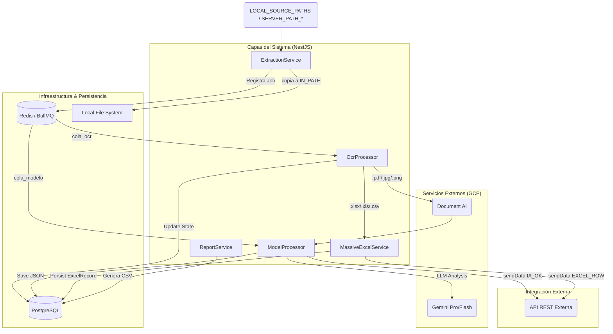

# 🏛 Arquitectura y Flujos

Detalle del pipeline, diagramas y módulos. Consultar al trabajar en `extraction`, `ocr`, `model`, `report`, `tenant`, `integration`.

## Diagrama de Arquitectura (Container Level)

## Flujo Masivo (Excel/CSV)

`MassiveExcelService` bypasea OCR/IA por completo (`.xlsx`/`.xls`/`.csv` deben ir directo a DB). Lee workbook con `exceljs` streaming → detecta tipo oficio → `mapRowToPayload()` por fila → consecutivo atómico via `DailySequenceService` → persiste en `ExcelRecord` (idempotente: limpia registros previos del mismo archivo antes de re-insertar) → `startBatch` → `sendData` por fila con concurrencia controlada → mueve archivo a `EXCEL_DESTINATION_PATH` → estado `EXCEL_OK`.

## Flujo Individual (OCR + IA)

`OcrProcessor` → Document AI → texto OCR → `ModelProcessor` → Gemini (con fallback multi-modelo) → post-procesa JSON (fechas, `nombreOficioFinal` con consecutivo atómico, rename archivo) → mueve a `OCR_DESTINATION_PATH` → `sendData` → estado `IA_OK`.

## Pipeline de estados

`INGRESADO → EN_COLA_OCR → PROCESANDO_OCR → EN_COLA_MODELO → PROCESANDO_MODELO → IA_OK`

Estados terminales de error: `ERROR_OCR`, `MODEL_ERROR`, `FORMATO_NO_SOPORTADO`, `OCR_UNREADABLE`, `DUPLICADO`.
Excel: `PROCESANDO_EXCEL → EXCEL_OK | ERROR_EXCEL`.

## Multitenancy (`src/modules/tenant`)

`TenantModule` (`@Global()`) provee `'TENANT_PROFILE'` token. Perfiles en `src/modules/tenant/profiles/*.profile.ts`. Cada perfil define: `promptTemplate`, `responseSchema` (Gemini Schema), `clientFields`, `nonClientFields`, `identifierKey`.

Al editar un perfil, mantener en sync: `responseSchema` (lo que Gemini debe retornar), `promptTemplate` (reglas de extracción), y `clientFields`/`nonClientFields` (misma forma JSON desde distintos ángulos).

## Integración Externa (`src/modules/integration`)

`IntegrationService` (`@Global()`) cachea bearer token (refresh 1 min antes de expirar). Expone `sendData(json, source)` y `startBatch(...)`. Si la URL no está configurada, hace log y no-op (el pipeline sigue funcionando sin integración).

## Otras notas

- `FolderInitializerService` crea todas las carpetas configuradas al arranque.
- `src/main.ts` resuelve `GOOGLE_APPLICATION_CREDENTIALS` a path absoluto y sirve Swagger en `/api/docs`.
