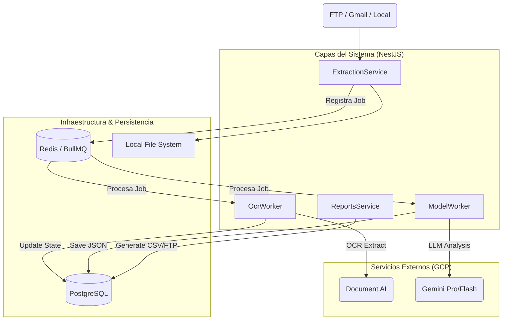
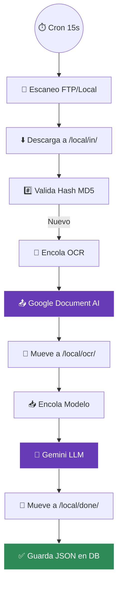

# 🤖 Protocolo de Agentes y Memoria Compartida

## 📋 Contexto del Proyecto
**Nombre:** JT-REPO (Finky Judicial Tracking)  
**Stack:** NestJS, Prisma (PostgreSQL), Redis (BullMQ), Google Document AI, Google Gemini.  
**Objetivo:** Automatizar el procesamiento de documentos judiciales mediante OCR avanzado e Inteligencia Artificial generativa para extraer datos estructurados (34 campos) con soporte multitenant.

## 📂 Estructura del Proyecto
- `src/`: Código fuente NestJS.
  - `modules/`: Lógica de negocio (Extraction, Pipeline, Gemini, Reports, etc.).
  - `common/`: Servicios transversales e inicializadores.
- `local/`: Persistencia local temporal (carpetas `in`, `ocr`, `done`).
- `migrations/`: Migraciones de Prisma/PostgreSQL.
- `ftp/`: Simulación o almacenamiento local para flujos FTP.
- `schema.prisma`: Definición del modelo de datos (`snake_case` en SQL).

## 🏛 Arquitectura y Flujos

### 🧩 Diagrama de Arquitectura (Container Level)
Este diagrama muestra la interacción entre los módulos de NestJS, la persistencia y los servicios externos de IA.

### 📋 Flujo de Procesamiento (Modo FTP)
Representación visual del ciclo de vida de un documento judicial.

## 🛠 Patrones de Diseño y Convenciones
- **Nomenclatura:** `snake_case` para DB, `camelCase` para código TS (vía `@map` en Prisma).
- **IA:** Structured Outputs nativos de Gemini (MIME application/json).
- **Resiliencia:** Backoff exponencial y Pattern Fallback Multi-Modelo.

## ⚙️ Capacidades y Herramientas (Skills)
- **backend-architect:** Evolución de patrones de diseño.
- **gemini-api-dev:** Optimización de prompts y cuotas.
- **lint-and-validate:** Calidad en cada commit.
- **database-design:** Gestión de esquemas y auditoría.
- **mermaid-expert:** Diagramación técnica avanzada.
- **design-md:** Síntesis y documentación de arquitectura.
- **c4-container:** Documentación arquitectura técnica.

## 🧠 Registro de Decisiones
| Fecha | Decisión Técnica | Justificación / Contexto |
| :--- | :--- | :--- |
| 2026-03-31 | Creación de AGENTS.md | Estandarización de memoria maestra y eliminación de MEMORY.md (SSoT). |
| 2026-03-18 | Patrón Strict JSON (Gemini) | Uso de Structured Outputs nativos para garantizar 100% consistencia en el parsing. |
| 2026-03-18 | Redis Distributed Lock | Cambio de .lock en FS por Redis para escalabilidad horizontal en ExtractionService. |
| 2026-03-18 | Arquitectura Multi-Tenant | Inyección dinámica de TenantProfile para desacoplar prompts y configuraciones. |
| 2026-03-18 | Cascade Fallback Multi-Modelo | Rotación entre Flash 2.5, 1.5 y Pro para eludir cuotas RPM individuales de Google Cloud. |
| 2026-02-19 | Implementación BullMQ | Segregación de OCR y Modelo en colas independientes para absorber picos de carga. |
| 2026-02-19 | Hash MD5 Deduplicación | Firma única de binario para evitar re-procesar archivos idénticos y ahorrar costos. |

## 🔄 Estado de Tareas
- [x] Migración de Memoria a AGENTS.md.
- [ ] Implementar Bull Dashboard para monitoreo visual (Propuesta).
- [ ] Separar GmailExtractionStrategy en módulo propio (Postergado).
- [ ] Configuración de credenciales reales en .env.
