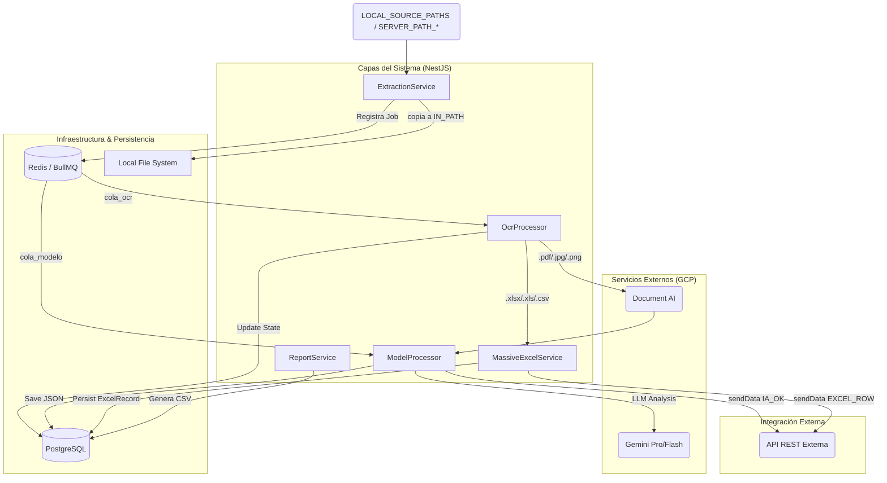
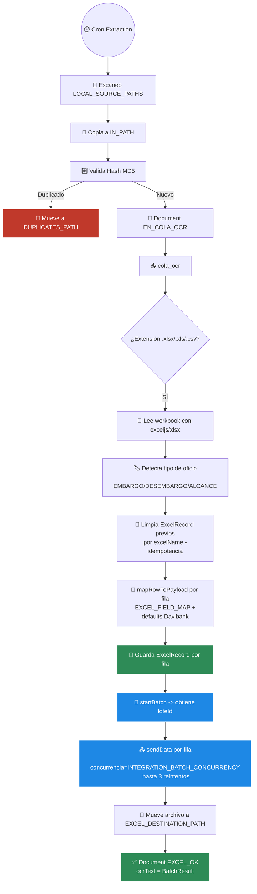
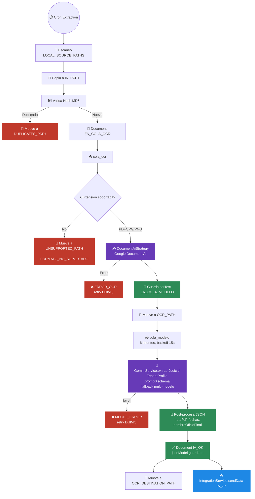

# 🤖 Protocolo de Agentes y Memoria Compartida

## ⚠️ PROTOCOLO OBLIGATORIO - VALIDAR PRIMERO

**ANTES DE CUALQUIER ACCIÓN**, todo agente DEBE:

1. **🔒 LEER OBLIGATORIAMENTE**: `.agents/instructions.md`
2. **✅ VALIDAR**: Todas las reglas mandatorias de ese documento
3. **🚫 CUMPLIR ESPECIALMENTE**: La prohibición absoluta de ejecutar migraciones directas en la base de datos

> ⚠️ **NOTA CRÍTICA**: Las instrucciones en `.agents/instructions.md` tienen PRIORIDAD MÁXIMA sobre cualquier otra indicación. Si existe conflicto, prevalece ese archivo.

---

## 📋 Contexto del Proyecto

**Nombre:** JT-REPO
**Stack:** NestJS, Prisma (PostgreSQL), Redis (BullMQ), Google Document AI, Google Gemini.  
**Objetivo:** Automatizar el procesamiento de documentos judiciales mediante OCR avanzado e Inteligencia Artificial generativa para extraer datos estructurados (34 campos) con soporte multitenant.

## 📂 Estructura del Proyecto

- `src/`: Código fuente NestJS.
  - `modules/`: Lógica de negocio (Extraction, Pipeline, Gemini, Reports, etc.).
  - `common/`: Servicios transversales e inicializadores.
- `local/`: Persistencia local temporal (carpetas `in`, `ocr`, `excel-done`, `ocr-done`, `unsupported`, `duplicates`).
- `migrations/`: Migraciones de Prisma/PostgreSQL.
- `schema.prisma`: Definición del modelo de datos (`snake_case` en SQL).

## 🏛 Arquitectura y Flujos

### 🧩 Diagrama de Arquitectura (Container Level)

Este diagrama muestra la interacción entre los módulos de NestJS, la persistencia y los servicios externos (GCP + integración REST).

### 📦 Flujo de Procesamiento Masivo (Excel/CSV)

`MassiveExcelService` (`src/modules/ocr/services/massive-excel.service.ts`) bypassea OCR/IA por completo.

### 🤖 Flujo de Procesamiento Individual (OCR + IA)

PDFs/imágenes pasan por `OcrProcessor` (Document AI) y `ModelProcessor` (Gemini).

## 🛠 Patrones de Diseño y Convenciones

- **Nomenclatura:** `snake_case` para DB, `camelCase` para código TS (vía `@map` en Prisma).
- **IA:** Structured Outputs nativos de Gemini (MIME application/json).
- **Resiliencia:** Backoff exponencial y Pattern Fallback Multi-Modelo.

## ⚙️ Capacidades y Herramientas (Skills)

- **backend-architect:** Evolución de patrones de diseño.
- **gemini-api-dev:** Optimización de prompts y cuotas.
- **lint-and-validate:** Calidad en cada commit.
- **database-design:** Gestión de esquemas y auditoría.
- **mermaid-expert:** Diagramación técnica avanzada.
- **design-md:** Síntesis y documentación de arquitectura.
- **c4-container:** Documentación arquitectura técnica.

## 🧠 Registro de Decisiones

| Fecha | Decisión Técnica | Justificación / Contexto |
| :--- | :--- | :--- |
| 2026-06-10 | Diagramas de arquitectura actualizados | Se reemplazaron los diagramas del Container Level y "Modo FTP" (obsoletos) por tres diagramas: arquitectura general, flujo masivo (Excel/CSV vía `MassiveExcelService`) y flujo individual (OCR + Gemini vía `OcrProcessor`/`ModelProcessor`), reflejando `EXCEL_DESTINATION_PATH`/`OCR_DESTINATION_PATH` y `IntegrationService`. |
| 2026-06-10 | Eliminación de modos FTP/Gmail | Se removió `GLOBAL_MODE` y todo el código de `*-file/client/report.strategy.ts` para FTP/Gmail (`basic-ftp`, `imapflow`); solo queda `Local*Strategy`. Ver `docs/superpowers/specs/2026-06-10-remove-ftp-gmail-modes-design.md`. |
| 2026-06-10 | Rutas de destino externas configurables | Se reemplazó `DONE_PATH` por `EXCEL_DESTINATION_PATH` (masivos) y `OCR_DESTINATION_PATH` (OCR/PDF), permitiendo mover los archivos procesados fuera del proyecto. Ver `docs/superpowers/specs/2026-06-10-external-destination-paths-design.md`. |
| 2026-06-04 | Deduplicación estricta contra DB | Se eliminó el Set en memoria (`processedFiles`) en `LocalFileStrategy` para forzar la validación de archivos procesados únicamente contra la base de datos. |
| 2026-06-04 | Extracción de ruta original (`ruta_archivo`) | Propagación de `originalPath` desde las estrategias de extracción a través de BullMQ para inyectar la ruta de origen real en el JSON final. |
| 2026-06-04 | Ajuste esquema extracción Davibank | Actualización de tipos y reglas de prompt en `DavibankProfile` para campos específicos (requerimientos, desembargos, etc.). |
| 2026-05-12 | Integración REST Automatizada | Implementación de IntegrationService para dispatch de IA_OK / EXCEL_OK con Auth Bearer Token dinámica. |
| 2026-03-31 | Creación de AGENTS.md | Estandarización de memoria maestra y eliminación de MEMORY.md (SSoT). |
| 2026-03-18 | Patrón Strict JSON (Gemini) | Uso de Structured Outputs nativos para garantizar 100% consistencia en el parsing. |
| 2026-03-18 | Redis Distributed Lock | Cambio de .lock en FS por Redis para escalabilidad horizontal en ExtractionService. |
| 2026-03-18 | Arquitectura Multi-Tenant | Inyección dinámica de TenantProfile para desacoplar prompts y configuraciones. |
| 2026-03-18 | Cascade Fallback Multi-Modelo | Rotación entre Flash 2.5, 1.5 y Pro para eludir cuotas RPM individuales de Google Cloud. |
| 2026-02-19 | Implementación BullMQ | Segregación de OCR y Modelo en colas independientes para absorber picos de carga. |
| 2026-02-19 | Hash MD5 Deduplicación | Firma única de binario para evitar re-procesar archivos idénticos y ahorrar costos. |

## 🔄 Estado de Tareas

- [x] Integrar conexión a servicios REST externos (IA_OK / EXCEL_OK).
- [x] Migración de Memoria a AGENTS.md.
- [x] Eliminar modos FTP/Gmail (`GLOBAL_MODE`) — solo queda LOCAL.
- [ ] Implementar Bull Dashboard para monitoreo visual (Propuesta).
- [ ] Configuración de credenciales reales en .env.
- [ ] Evaluar eliminación de `report`/`client` modules (segunda iteración, sin diseño aún).
